# Lapres Jarkom Modul 2

| Nama | NRP |
| --------------------- | ----------------------- |
| Monika Damelia Hutapea | 5027221011 |
| Naufan Zaki Lugmanulhakim | 5027221065 |
# SetUp
## Address
- Pochinki (192.245.1.2) (Master)
- Georgopol (192.245.1.3) (Slave)
- Rozhok (192.245.2.2) (Client)
- School (192.245.2.3) (Client)
- FerryPier (192.245.2.4) (Client)
- Mylta (192.245.2.5) (Load Balancer)
- Severny (192.245.3.2) (Webserver)
- Stalber (192.245.3.3) (Webserver)
- Lipovka (192.245.3.4) (Webserver)

## Topology
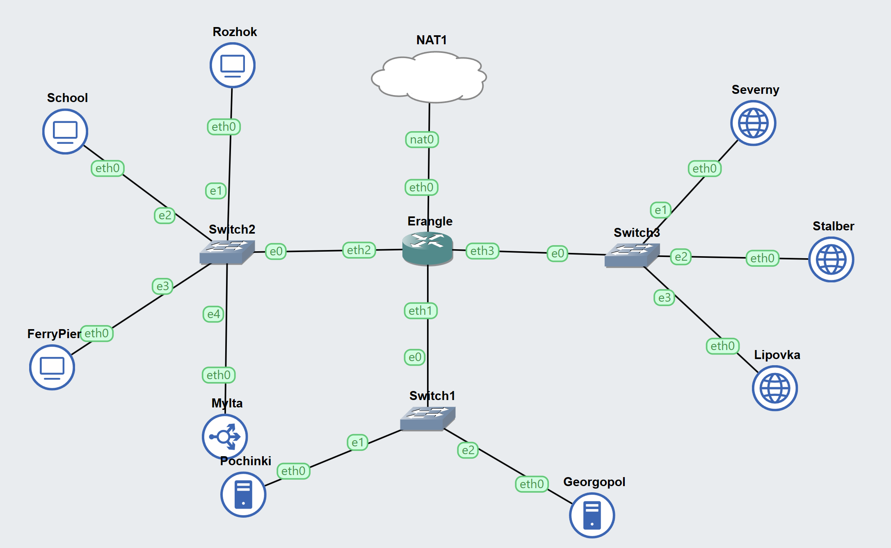

## Start Server
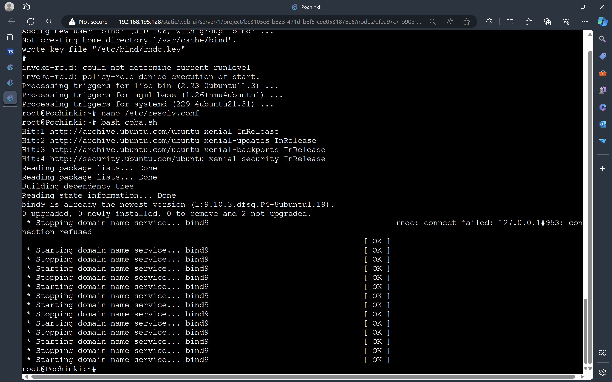
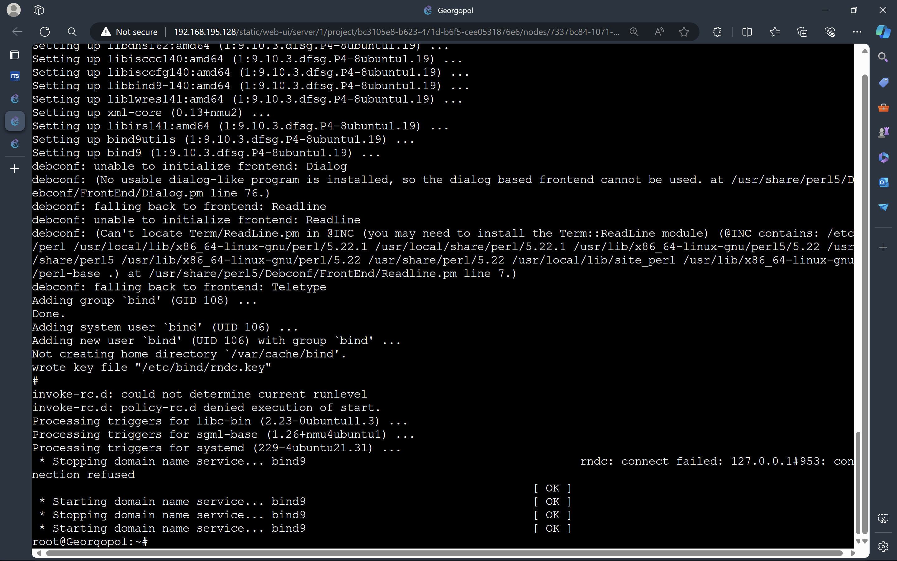

## Membuat /etc/resolv.conf di setiap node client
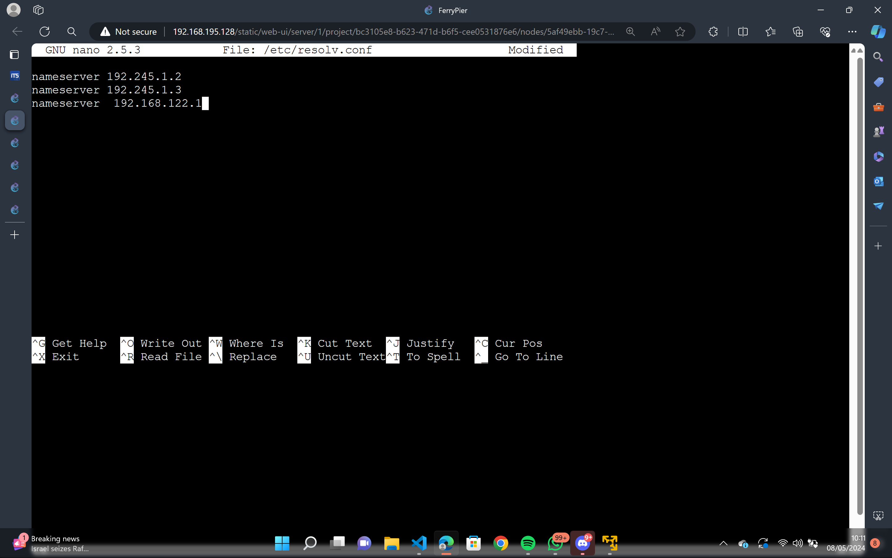

## Script.sh
[bash file untuk Pochinki](Script/script.sh)
[bash file untuk georgopol](Script/georgopol.sh)

## Pengerjaan Soal
### Soal 1
1. DNS Master Pochinki
2. DNS Slave Georgopol
3. Webserver Severny, Stalber, Lipovka
4. Load Balancer Mylta
### Soal 2
1. buat script.sh, run dengan `bash script.sh` untuk pochinki dengan isi berikut
```# 2
echo 'zone "airdrop.IT24.com" {
        type master;
        file "/etc/bind/jarkom/airdrop.IT24.com";
};' > /etc/bind/named.conf.local

mkdir /etc/bind/jarkom

cp /etc/bind/db.local /etc/bind/jarkom/airdrop.IT24.com

echo '
;
; BIND data file for local loopback interface
;
$TTL    604800
@       IN      SOA     airdrop.IT24.com. root.airdrop.IT24.com. (
                        2024050301      ; Serial
                         604800         ; Refresh
                          86400         ; Retry
                        2419200         ; Expire
                         604800 )       ; Negative Cache TTL
;
@       IN      NS      airdrop.IT24.com.
@       IN      A        192.245.3.3
www     IN      CNAME   airdrop.IT24.com.' > /etc/bind/jarkom/airdrop.IT24.com

service bind9 restart
```
#### Output
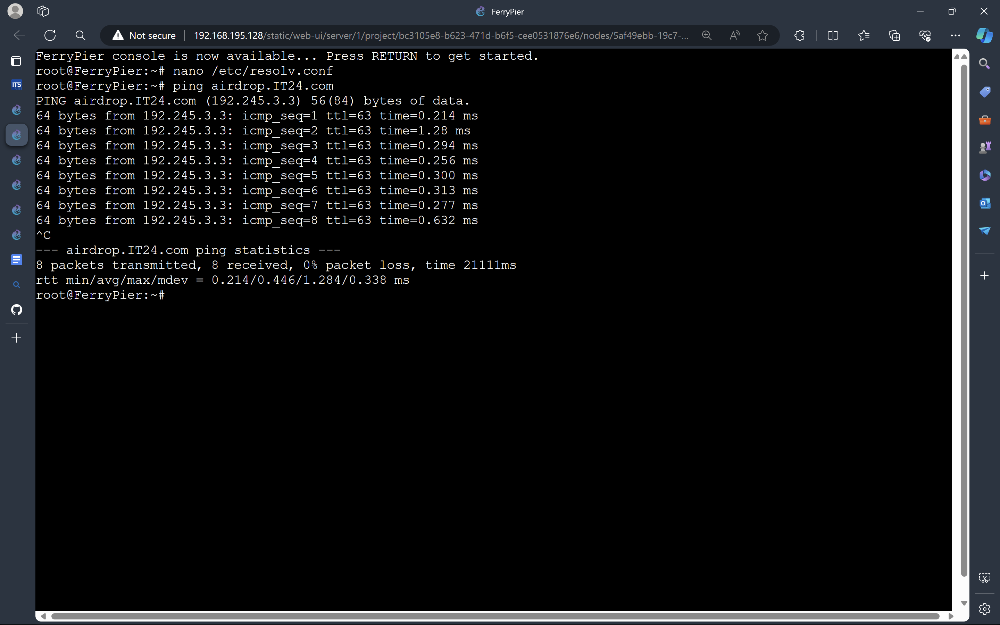
### Soal 3
1. Tambah script.sh pochinki dengan ini
```echo 'zone "redzone.IT24.com" {
        type master;
        file "/etc/bind/jarkom/redzone.IT24.com";
};' > /etc/bind/named.conf.local

cp /etc/bind/db.local /etc/bind/jarkom/redzone.IT24.com

echo ' 
;
; BIND data file for local loopback interface
;
$TTL    604800
@       IN      SOA     redzone.IT24.com. root.redzone.IT24.com. (
                        2024050301      ; Serial
                         604800         ; Refresh
                          86400         ; Retry
                        2419200         ; Expire
                         604800 )       ; Negative Cache TTL
;
@       IN      NS      redzone.IT24.com.
@       IN      A       192.245.3.2
www     IN      CNAME   redzone.IT24.com.' > /etc/bind/jarkom/redzone.IT24.com

service bind9 restart
```
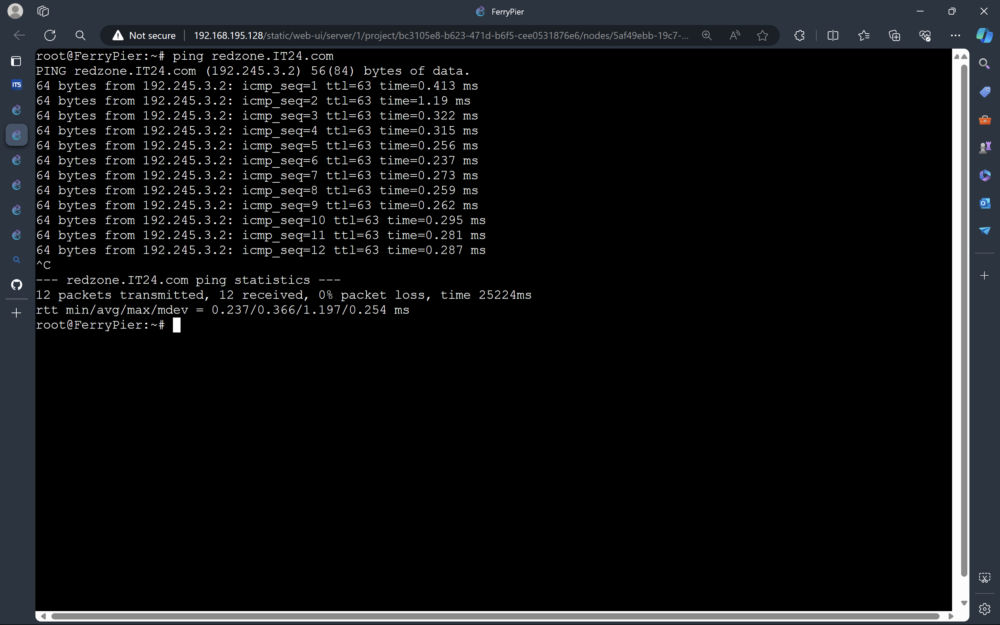
### Soal 4
1. Tambah script.sh pochinki dengan ini
```echo 'zone "loot.IT24.com" {
        type master;
        file "/etc/bind/jarkom/loot.IT24.com";
};' >> /etc/bind/named.conf.local

cp /etc/bind/db.local /etc/bind/jarkom/loot.IT24.com

echo ' 
;
; BIND data file for local loopback interface
;
$TTL    604800
@       IN      SOA     loot.IT24.com. root.loot.IT24.com. (
                        2024050301      ; Serial
                         604800         ; Refresh
                          86400         ; Retry
                        2419200         ; Expire
                         604800 )       ; Negative Cache TTL
;
@       IN      NS      loot.IT24.com.
@       IN      A       192.245.2.5
www     IN      CNAME   loot.IT24.com.' > /etc/bind/jarkom/loot.IT24.com

service bind9 restart
```
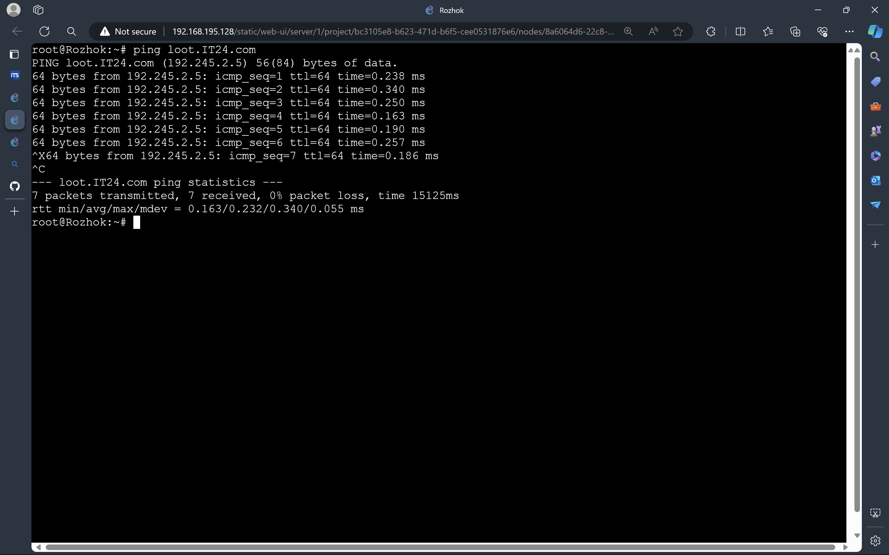
### Soal 5
#### Output
Ferrypier
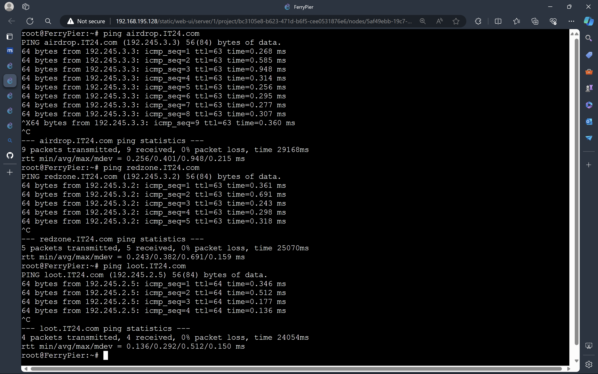
Rozhok
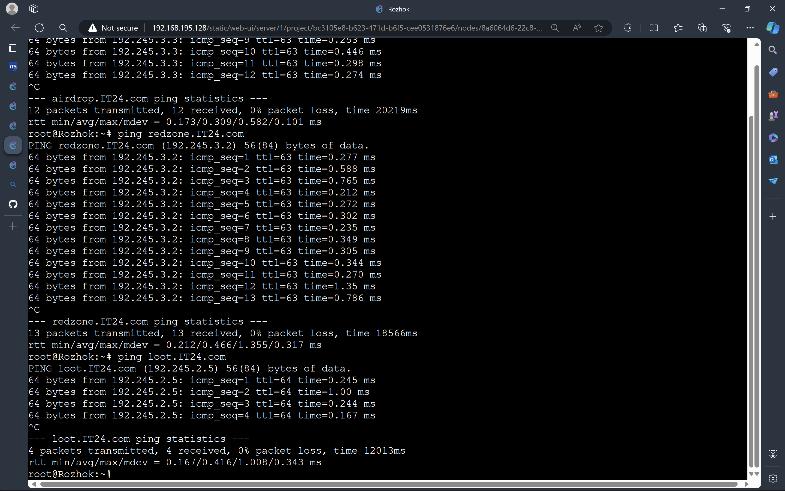
School
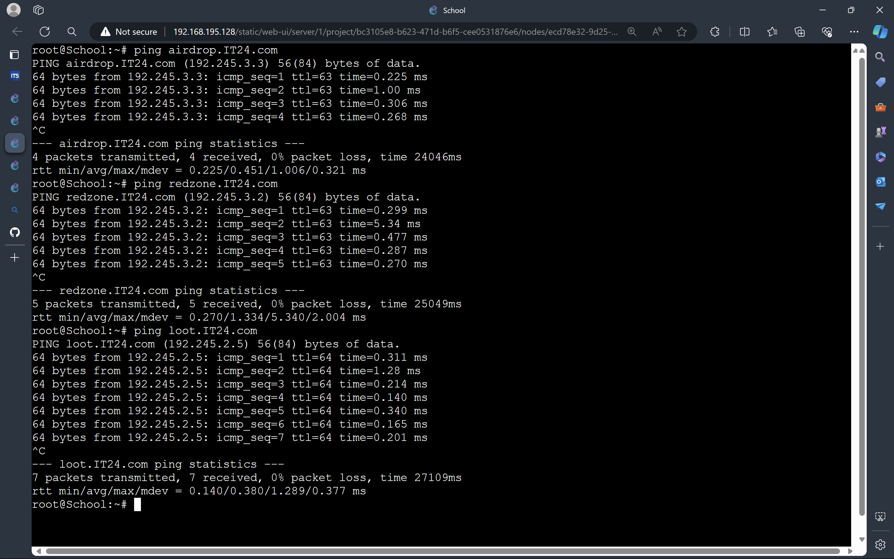
### Soal 6
```echo ' zone "2.3.245.192.in-addr.arpa" {
        type master;
        file "/etc/bind/jarkom/2.3.245.192.in-addr.arpa";
};' >> /etc/bind/named.conf.local

cp /etc/bind/db.local /etc/bind/jarkom/2.3.245.192.in-addr.arpa

echo '
;
; BIND data file for local loopback interface
;
$TTL    604800
@       IN      SOA     redzone.IT24.com. root.redzone.IT24.com. (
                        2003101001      ; Serial
                         604800         ; Refresh
                          86400         ; Retry
                        2419200         ; Expire
                         604800 )       ; Negative Cache TTL
;
2.3.245.192.in-addr.arpa. IN      NS      redzone.IT24.com.
1                     IN      PTR     redzone.IT24.com.' > /etc/bind/jarkom/2.3.245.192.in-addr.arpa

service bind9 restart
```
#### Output
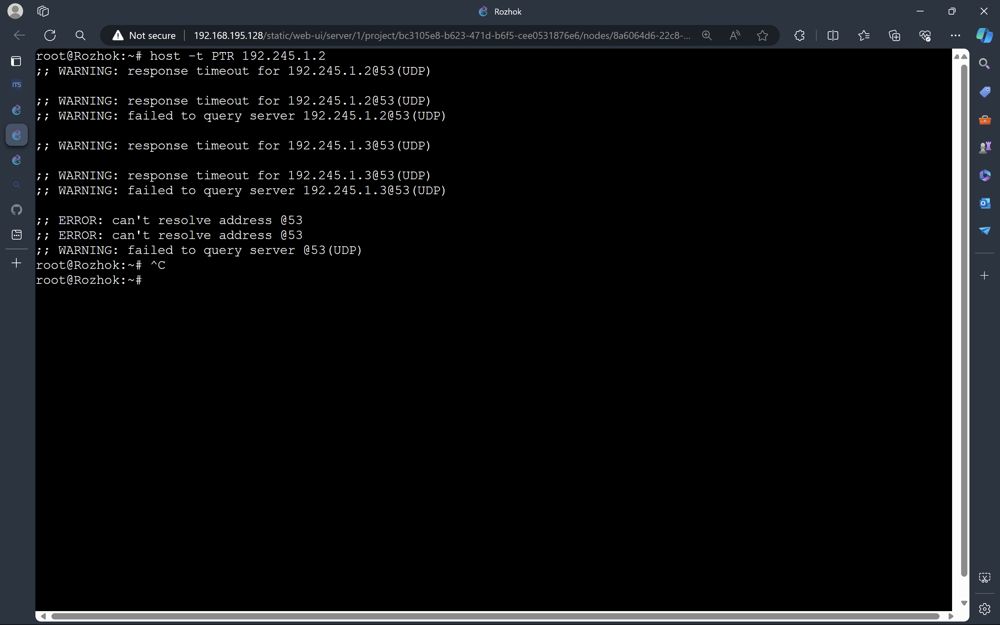
Gagal ptr
### Soal 7
```echo 'zone "airdrop.IT24.com" {
        type master;
        file "/etc/bind/jarkom/airdrop.IT24.com";
        allow-transfer { 192.245.1.3; };
        also-notify { 192.245.1.3; };
};' > /etc/bind/named.conf.local


echo 'zone "redzone.IT24.com" {
        type master;
        file "/etc/bind/jarkom/redzone.IT24.com";
        also-notify { 192.245.1.3; }; // Masukan IP Water7 tanpa tanda petik
        allow-transfer { 192.245.1.3; }; // Masukan IP Water7 tanpa tanda petik
   
};' >> /etc/bind/named.conf.local

echo 'zone "loot.IT24.com" {
        type master;
        file "/etc/bind/jarkom/loot.IT24.com";
        also-notify { 192.245.1.3; }; // Masukan IP Water7 tanpa tanda petik
        allow-transfer { 192.245.1.3; }; // Masukan IP Water7 tanpa tanda petik
   
};' >>/etc/bind/named.conf.local

service bind9 restart
```
Buat georgopol.sh dengan isi ini
```
echo 'zone "airdrop.IT24.com" {
    type slave;
    masters { 192.245.1.2; }; // Masukan IP EniesLobby tanpa tanda petik
    file "/var/lib/bind/airdrop.IT24.com";
};

zone "redzone.IT24.com" {
    type slave;
    masters { 192.245.1.2; }; // Masukan IP EniesLobby tanpa tanda petik
    file "/var/lib/bind/redzone.IT24.com";
};

zone "loot.IT24.com" {
    type slave;
    masters { 192.245.1.2; }; // Masukan IP EniesLobby tanpa tanda petik
    file "/var/lib/bind/loot.IT24.com";
};'  > /etc/bind/named.conf.local
```
berhentikan dengan service bind9 stop
jika slave nyala master mati client harus tetap bisa ping
jika dua duanya sudah diberhentikan maka tidak bisa ping
#### Output
Start Georgopol
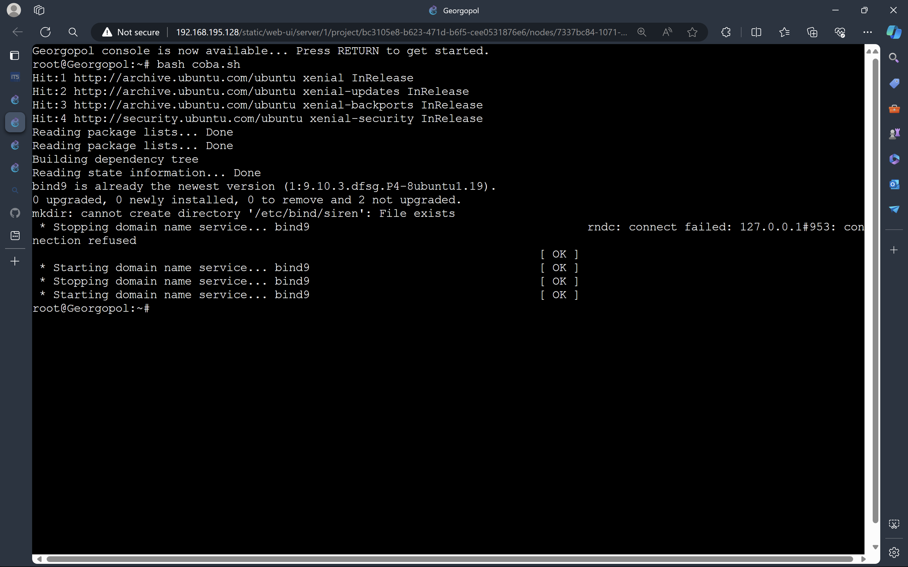
Stop Pochinki
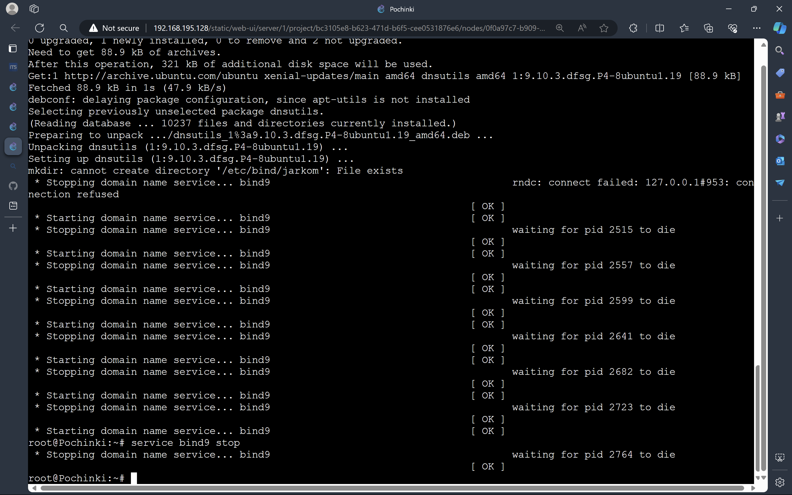
Test di Client
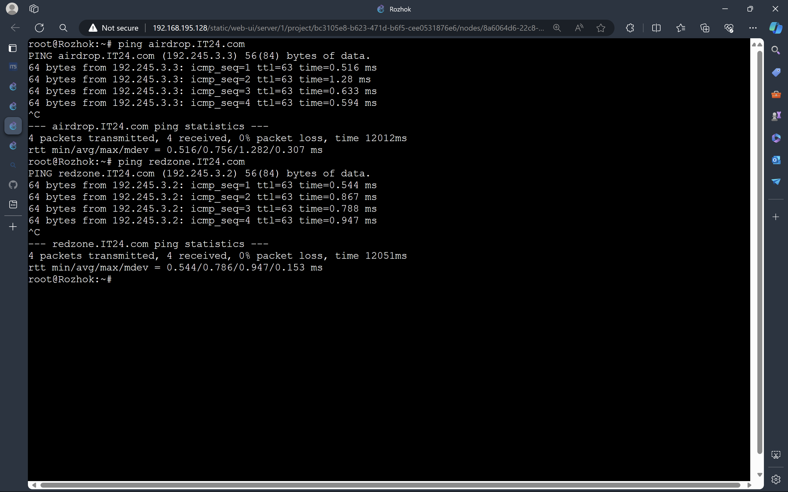

### Soal 8
1. tambah ini ke script.sh
```
echo '
;
; BIND data file for local loopback interface
;
$TTL    604800
@       IN      SOA     airdrop.IT24.com. root.airdrop.IT24.com. (
                        2023101001      ; Serial
                         604800         ; Refresh
                          86400         ; Retry
                        2419200         ; Expire
                         604800 )       ; Negative Cache TTL
;
@       IN      NS      airdrop.IT24.com.
@       IN      A        192.245.3.3   ; 
www     IN      CNAME   airdrop.IT24.com.
medkit  IN      A       192.245.3.4     ;' > /etc/bind/jarkom/airdrop.IT24.com

service bind9 restart
```
ping medkit airdrop di client `ping medkit.IT24.com`

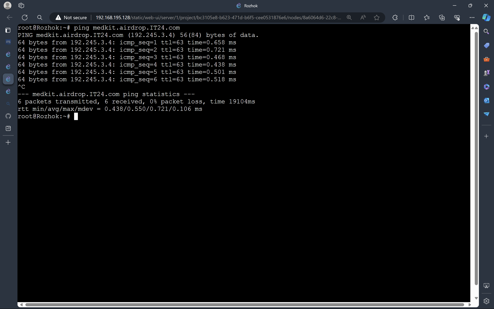

### Soal 9
1. tambah ini ke script.sh
```
echo ';
; BIND data file for local loopback interface
;
$TTL    604800
@       IN      SOA     redzone.IT24.com. root.redzone.IT24.com. (
                        2023101001      ; Serial
                         604800         ; Refresh
                          86400         ; Retry
                        2419200         ; Expire
                         604800 )       ; Negative Cache TTL
;
@       IN      NS      redzone.IT24.com.
@       IN      A       192.245.3.2
www     IN      CNAME   redzone.IT24.com.
ns1     IN      A       192.245.1.3     ; IP georgopol
siren   IN      NS      ns1' > /etc/bind/jarkom/redzone.IT24.com


echo "options {
    directory \"/var/cache/bind\";

    // If there is a firewall between you and nameservers you want
    // to talk to, you may need to fix the firewall to allow multiple
    // ports to talk.  See http://www.kb.cert.org/vuls/id/800113

    // If your ISP provided one or more IP addresses for stable
    // nameservers, you probably want to use them as forwarders.
    // Uncomment the following block, and insert the addresses replacing
    // the all-0's placeholder.  
    // };

    //========================================================================
    // If BIND logs error messages about the root key being expired,
    // you will need to update your keys.  See https://www.isc.org/bind-keys
    //========================================================================
    //dnssec-validation auto;

    allow-query { any; };
    auth-nxdomain no;
    listen-on-v6 { any; };
};" > /etc/bind/named.conf.options

service bind9 restart
```
2. tambahkan ini ke georgopol.sh
```
echo "
options {
        directory \"/var/cache/bind\";
        allow-query{any;};
        auth-nxdomain no;    # conform to RFC1035
        listen-on-v6 { any; };
};
" > /etc/bind/named.conf.options

echo '

zone "siren.redzone.IT24.com"{
        type master;
        file "/etc/bind/siren/siren.redzone.IT24.com";
};
'>> /etc/bind/named.conf.local

mkdir /etc/bind/siren

echo "
\$TTL    604800
@       IN      SOA     siren.redzone.IT24.com. root.siren.redzone.IT24.com. (
                        2021100401      ; Serial
                        604800         ; Refresh
                        86400         ; Retry
                        2419200         ; Expire
                        604800 )       ; Negative Cache TTL
;
@               IN      NS      siren.redzone.IT24.com.
@               IN      A       192.245.3.2       ;ip skypie
www             IN      CNAME   siren.redzone.IT24.com.
" > /etc/bind/siren/siren.redzone.IT24.com
service bind9 restart
```
3. jalankan georgopol.sh dan script.sh terlebih dahulu lalu baru lanjut ping
4. ping siren.redzone.IT24.com dan ping www.siren.redzone.IT24.com

#### Output
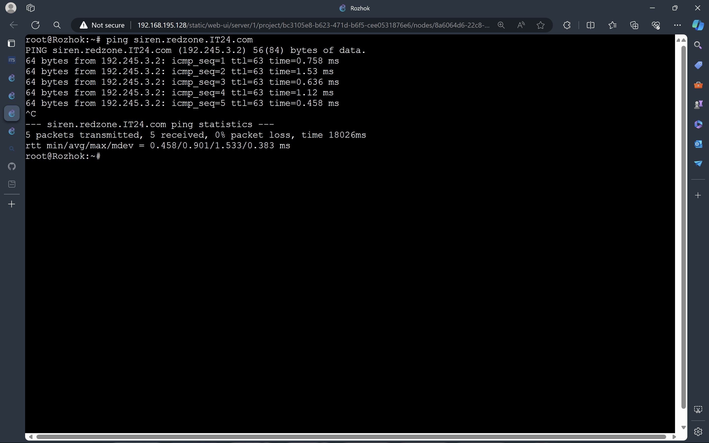

### Soal 10
1. tambahkan ini ke georgopol.sh
```
echo "
\$TTL    604800
@       IN      SOA     siren.redzone.IT24.com. root.siren.redzone.IT24.com. (
                        2021100401      ; Serial
                        604800         ; Refresh
                        86400         ; Retry
                        2419200         ; Expire
                        604800 )       ; Negative Cache TTL
;
@               IN      NS      siren.redzone.IT24.com.
@               IN      A       192.245.3.2       ;
www             IN      CNAME   siren.redzone.IT24.com.
log             IN      A       192.245.3.2      ; 
www.log         IN      CNAME   log.siren.redzone.IT24.com." > /etc/bind/siren/siren.redzone.IT24.com
service bind9 restart
```
#### Output


### Soal 11

Setelah pertempuran mereda, warga Erangel dapat kembali mengakses jaringan luar, tetapi hanya warga Pochinki saja yang dapat mengakses jaringan luar secara langsung. Buatlah konfigurasi agar warga Erangel yang berada diluar Pochinki dapat mengakses jaringan luar melalui DNS Server Pochinki

**Pada Pochinki**

```

echo '
options {
        directory "/var/cache/bind";
        forwarders {
                192.168.122.1;
        };
        allow-query { any; };
        auth-nxdomain no; #conform to RFC1035
        listen-on-v6 { any; };
};' > /etc/bind/named.conf.options


```


**Paada Georgopol**

```

echo '
options {
        directory "/var/cache/bind";
        forwarders {
                192.245.1.2; //ip pochinki
        };
        allow-query { any; };
        auth-nxdomain no; #conform to RFC1035
        listen-on-v6 { any; };
};' > /etc/bind/named.conf.options


```


**Pada Klien**

```

echo '
nameserver 192.245.1.2
' > /etc/resolv.conf


ping google.com

```


### Soal 12

Karena pusat ingin sebuah website yang ingin digunakan untuk memantau kondisi markas lainnya maka deploy lah webiste ini (cek resource yg lb) pada severny menggunakan apache

```

# severny

echo '
nameserver 192.168.122.1
' > /etc/resolv.conf
apt-get update
apt-get install lynx -y
apt-get install apache2 -y
apt-get install php -y
apt-get install libapache2-mod-php7.0 -y
apt-get install unzip -y
apt-get install wget -y
cp /etc/apache2/sites-available/000-default.conf /etc/apache2/sites-available/redzone.IT24.com.conf

echo '
<VirtualHost *:80>
        ServerAdmin webmaster@localhost
        DocumentRoot /var/www/redzone.IT24.com
        ServerName redzone.IT24.com
        ServerAlias www.redzone.IT24.com

        #LogLevel info ssl:warn

        ErrorLog ${APACHE_LOG_DIR}/error.log
        CustomLog ${APACHE_LOG_DIR}/access.log combined

        #Include conf-available/serve-cgi-bin.conf
</VirtualHost>

# vim: syntax=apache ts=4 sw=4 sts=4 sr noet
' > /etc/apache2/sites-available/redzone.IT24.com.conf

service apache2 start

# Membuat direktori redzone
mkdir /var/www/redzone.IT24.com

# Aktifkan konfigurasi situs
a2ensite redzone.IT24.com.conf

# Unduh dan ekstrak file redzone.zip
wget --no-check-certificate "https://drive.google.com/file/d/1xn03kTB27K872cokqwEIlk8Zb121HnfB/view?usp=sharing" -O redzone.zip
unzip redzone.zip -d redzone

# Pindahkan isi direktori redzone ke direktori tujuan
mv redzone/* /var/www/redzone.IT24.com/

echo '
nameserver 192.245.1.2
' > /etc/resolv.conf


# Klien

echo '
nameserver 192.168.122.1
' > /etc/resolv.conf

apt-get update
apt-get install lynx -y

echo '
nameserver 192.245.1.2 # pochinki
nameserver 192.245.1.3 # georgopol
' > /etc/resolv.conf
lynx http://www.redzone.IT24.com


```

**Output**


### Soal 13

Tapi pusat merasa tidak puas dengan performanya karena traffic yag tinggi maka pusat meminta kita memasang load balancer pada web nya, dengan Severny, Stalber, Lipovka sebagai worker dan Mylta sebagai Load Balancer menggunakan apache sebagai web server nya dan load balancernya

**Webserver (Stalber/Severny/Lipovka)**

```

echo 'nameserver 192.168.122.1' > /etc/resolv.conf
apt-get update 
apt-get install php -y
apt-get install unzip -y

curl -L -o lb.zip --insecure "https://drive.google.com/uc?export=download&id=1xn03kTB27K872cokqwEIlk8Zb121HnfB"

unzip lb.zip
rm /var/www/html/index.html
cp worker/index.php /var/www/html/index.php
apt-get install libapache2-mod-php7.0

service apache2 start

```

**Load balancer (Mylta)**

```
echo 'nameserver 192.168.122.1' > /etc/resolv.conf

a2enmod proxy
a2enmod proxy_balancer
a2enmod proxy_http
a2enmod lbmethod_byrequests

echo '<VirtualHost *:80>

<Proxy balancer://mycluster>
BalancerMember http://192.245.3.2/
BalancerMember http://192.245.3.3/
BalancerMember http://192.2245.3.4/
ProxySet lbmethod=byrequests
</Proxy>

ProxyPass / balancer://mycluster/
ProxyPassReverse / balancer://mycluster/
</VirtualHost>
' > /etc/apache2/sites-available/000-default.conf

service apache2 start

```

**client**

```
apt-get install lynx apache2 php libapache2-mod-php7.0 nginx -y

lynx http://192.245.3.2/ 
lynx http://192.245.3.3/
lynx http://192.245.3.4/

```


### Soal 14

Mereka juga belum merasa puas jadi pusat meminta agar web servernya dan load balancer nya diubah menjadi nginx

**Web server (Stalber/Severny/Lipovka)**

```
service apache2 stop

apt install nginx php php-fpm -y

service php7.0-fpm start

echo 'server {
listen 80;

root /var/www/html;
index index.php index.html index.htm index.nginx-debian.html;

server_name _;

location / {
try_files $uri $uri/ /index.php?$query_string;
}

location ~ \.php$ {
include snippets/fastcgi-php.conf;
fastcgi_pass unix:/run/php/php7.0-fpm.sock;
}

location ~ /\.ht {
deny all;
}
}' > /etc/nginx/sites-enabled/default

service php7.0-fpm restart

service nginx restart

```

**Load balancer (Mylta)**

```

service apache2 stop

apt install nginx php php-fpm -y

echo 'upstream backend {
server 192.245.3.2; # IP Severny
server 192.245.3.3; # IP Stalber
server 192.245.3.4; # IP Lipovka
}

server {
listen 80;

location / {
proxy_pass http://backend;
}
}
' > /etc/nginx/sites-enabled/default

service nginx restart

```

**Client**

lynx http://192.245.3.2/ 
lynx http://192.245.3.3/
lynx http://192.245.3.4/


### Soal 15

Markas pusat meminta laporan hasil benchmark dengan menggunakan apache benchmark dari load balancer dengan 2 web server yang berbeda tersebut dan meminta secara detail dengan ketentuan:
Nama Algoritma Load Balancer
Report hasil testing apache benchmark 
Grafik request per second untuk masing masing algoritma. 
Analisis

**Menjalankan ab -n 1000 -c 100 http://192.245.2.5/**


### Soal 16

Karena dirasa kurang aman karena masih memakai IP, markas ingin akses ke mylta memakai mylta.xxx.com dengan alias www.mylta.xxx.com (sesuai web server terbaik hasil analisis kalian)

**Pochinki**

```

echo 'zone "mylta.IT24.com" {
        type master;
        file "/etc/bind/jarkom/mylta.IT24.com";
};' > /etc/bind/named.conf.local

mkdir /etc/bind/jarkom

cp /etc/bind/db.local /etc/bind/jarkom/mylta.IT24.com

echo '
;
; BIND data file for local loopback interface
;
$TTL    604800
@       IN      SOA     mylta.IT24.com. root.mylta.IT24.com. (
                              2         ; Serial
                         604800         ; Refresh
                          86400         ; Retry
                        2419200         ; Expire
                         604800 )       ; Negative Cache TTL
;
@       IN      NS      mylta.IT24.com.
@       IN      A       192.245.3.3     ; IP Stalber
www             IN      CNAME   mylta.IT24.com.
' > /etc/bind/jarkom/mylta.IT24.com

service bind9 restart

```

**MyIta**

```

service nginx stop

echo 'upstream backend {
server 192.245.3.2; # IP Severny
server 192.245.3.3; # IP Stalber
server 192.245.3.4; # IP Lipovka
}

server {
listen 80;
server_name mylta.IT24.com www.mylta.IT24.com; 

location / {
proxy_pass http://backend;
}
}
' > /etc/nginx/sites-enabled/default

service nginx restart

```

**Client**

```
lynx http://mylta.IT24.com
lynx http://www.mylta.IT24.com
```


### Soal 17

Agar aman, buatlah konfigurasi agar mylta.xxx.com hanya dapat diakses melalui port 14000 dan 14400.

**MyIta**

```

echo 'upstream backend {
server 192.245.3.2; # IP Severny
server 192.245.3.3; # IP Stalber
server 192.245.3.4; # IP Lipovka
}

server {
listen 14000;
listen 14400;
server_name mylta.IT24.com www.mylta.IT24.com; 

location / {
proxy_pass http://backend;
}
}
' > /etc/nginx/sites-enabled/default

service nginx restart

```

**Client**

```

lynx http://mylta.IT24.com:14000
lynx http://www.mylta.IT24.com:14000
lynx http://mylta.IT24.com:14400
lynx http://www.mylta.IT24.com:14400

```


# Soal 18

Apa bila ada yang mencoba mengakses IP mylta akan secara otomatis dialihkan ke www.mylta.xxx.com

**MyIta**

```
echo 'upstream backend {
server 192.245.3.2; # IP Severny
server 192.245.3.3; # IP Stalber
server 192.245.3.4; # IP Lipovka
}

server {
listen 14000;
listen 14400;
server_name mylta.IT24.com www.mylta.IT24.com; 

location / {
proxy_pass http://backend;
if ($host = 192.245.2.5) {
return 301 http://www.mylta.IT24.com:14000$request_uri;
}
}
}
' > /etc/nginx/sites-enabled/default

service nginx restart

```

**Client**

```
lynx http://192.245.2.5:14000
```
# 19 Karena probset sudah kehabisan ide masuk ke salah satu worker buatkan akses direktori listing yang mengarah ke resource worker2


# 20 Worker tersebut harus dapat di akses dengan tamat.xxx.com dengan alias www.tamat.xxx.com


## Revisi
1. Untuk revisi dari soal nomor 5 - 10, adalah dibagian etc/resolv.conf dimana IP dari servernya masih salah oleh karena itu masih belum bisa ping saat demo, dan di lapres ini sudah dibetulkan dan sudah berjalan dengan baik


