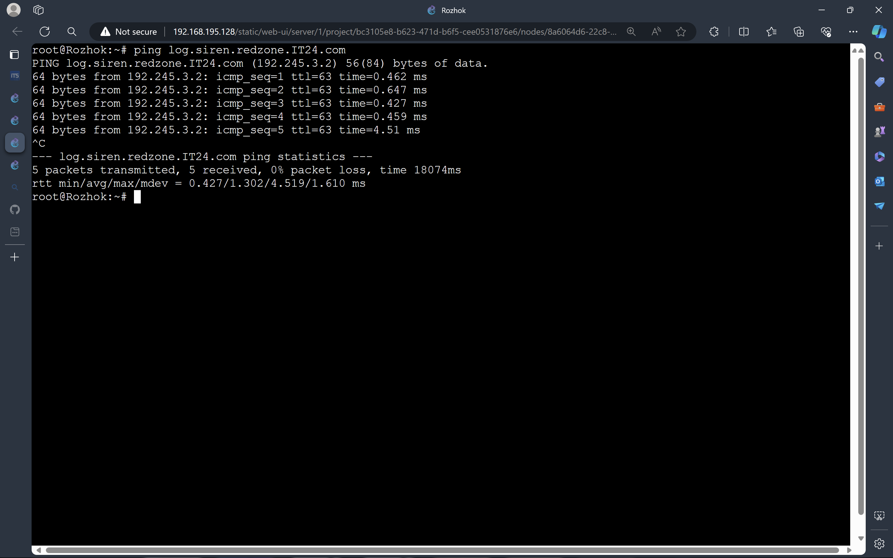

# Jarkom-Modul-1-IT23-2024

| Nama | NRP |
| --------------------- | ----------------------- |
| Monika Damelia Hutapea | 5027221011 |
| Naufan Zaki Lugmanulhakim | 5027221065 |

# SetUp
## Address
- Pochinki (192.245.1.2) (Master)
- Georgopol (192.245.1.3) (Slave)
- Rozhok (192.245.2.2) (Client)
- School (192.245.2.3) (Client)
- FerryPier (192.245.2.4) (Client)
- Mylta (192.245.2.5) (Load Balancer)
- Severny (192.245.3.2) (Webserver)
- Stalber (192.245.3.3) (Webserver)
- Lipovka (192.245.3.4) (Webserver)

## Topology


## Start Server


## Membuat /etc/resolv.conf di setiap node client


## Script.sh
[bash file untuk Pochinki](Script/script.sh)
[bash file untuk georgopol](Script/georgopol.sh)

## Pengerjaan Soal
### Soal 1
1. DNS Master Pochinki
2. DNS Slave Georgopol
3. Webserver Severny, Stalber, Lipovka
4. Load Balancer Mylta
### Soal 2
1. buat script.sh, run dengan `bash script.sh` untuk pochinki dengan isi berikut
```# 2
echo 'zone "airdrop.IT24.com" {
        type master;
        file "/etc/bind/jarkom/airdrop.IT24.com";
};' > /etc/bind/named.conf.local

mkdir /etc/bind/jarkom

cp /etc/bind/db.local /etc/bind/jarkom/airdrop.IT24.com

echo '
;
; BIND data file for local loopback interface
;
$TTL    604800
@       IN      SOA     airdrop.IT24.com. root.airdrop.IT24.com. (
                        2024050301      ; Serial
                         604800         ; Refresh
                          86400         ; Retry
                        2419200         ; Expire
                         604800 )       ; Negative Cache TTL
;
@       IN      NS      airdrop.IT24.com.
@       IN      A        192.245.3.3
www     IN      CNAME   airdrop.IT24.com.' > /etc/bind/jarkom/airdrop.IT24.com

service bind9 restart
```
#### Output

### Soal 3
1. Tambah script.sh pochinki dengan ini
```echo 'zone "redzone.IT24.com" {
        type master;
        file "/etc/bind/jarkom/redzone.IT24.com";
};' > /etc/bind/named.conf.local

cp /etc/bind/db.local /etc/bind/jarkom/redzone.IT24.com

echo ' 
;
; BIND data file for local loopback interface
;
$TTL    604800
@       IN      SOA     redzone.IT24.com. root.redzone.IT24.com. (
                        2024050301      ; Serial
                         604800         ; Refresh
                          86400         ; Retry
                        2419200         ; Expire
                         604800 )       ; Negative Cache TTL
;
@       IN      NS      redzone.IT24.com.
@       IN      A       192.245.3.2
www     IN      CNAME   redzone.IT24.com.' > /etc/bind/jarkom/redzone.IT24.com

service bind9 restart
```

### Soal 4
1. Tambah script.sh pochinki dengan ini
```echo 'zone "loot.IT24.com" {
        type master;
        file "/etc/bind/jarkom/loot.IT24.com";
};' >> /etc/bind/named.conf.local

cp /etc/bind/db.local /etc/bind/jarkom/loot.IT24.com

echo ' 
;
; BIND data file for local loopback interface
;
$TTL    604800
@       IN      SOA     loot.IT24.com. root.loot.IT24.com. (
                        2024050301      ; Serial
                         604800         ; Refresh
                          86400         ; Retry
                        2419200         ; Expire
                         604800 )       ; Negative Cache TTL
;
@       IN      NS      loot.IT24.com.
@       IN      A       192.245.2.5
www     IN      CNAME   loot.IT24.com.' > /etc/bind/jarkom/loot.IT24.com

service bind9 restart
```

### Soal 5
#### Output
Ferrypier

Rozhok

School

### Soal 6
```echo ' zone "2.3.245.192.in-addr.arpa" {
        type master;
        file "/etc/bind/jarkom/2.3.245.192.in-addr.arpa";
};' >> /etc/bind/named.conf.local

cp /etc/bind/db.local /etc/bind/jarkom/2.3.245.192.in-addr.arpa

echo '
;
; BIND data file for local loopback interface
;
$TTL    604800
@       IN      SOA     redzone.IT24.com. root.redzone.IT24.com. (
                        2003101001      ; Serial
                         604800         ; Refresh
                          86400         ; Retry
                        2419200         ; Expire
                         604800 )       ; Negative Cache TTL
;
2.3.245.192.in-addr.arpa. IN      NS      redzone.IT24.com.
1                     IN      PTR     redzone.IT24.com.' > /etc/bind/jarkom/2.3.245.192.in-addr.arpa

service bind9 restart
```
#### Output

Gagal ptr
### Soal 7
```echo 'zone "airdrop.IT24.com" {
        type master;
        file "/etc/bind/jarkom/airdrop.IT24.com";
        allow-transfer { 192.245.1.3; };
        also-notify { 192.245.1.3; };
};' > /etc/bind/named.conf.local


echo 'zone "redzone.IT24.com" {
        type master;
        file "/etc/bind/jarkom/redzone.IT24.com";
        also-notify { 192.245.1.3; }; // Masukan IP Water7 tanpa tanda petik
        allow-transfer { 192.245.1.3; }; // Masukan IP Water7 tanpa tanda petik
   
};' >> /etc/bind/named.conf.local

echo 'zone "loot.IT24.com" {
        type master;
        file "/etc/bind/jarkom/loot.IT24.com";
        also-notify { 192.245.1.3; }; // Masukan IP Water7 tanpa tanda petik
        allow-transfer { 192.245.1.3; }; // Masukan IP Water7 tanpa tanda petik
   
};' >>/etc/bind/named.conf.local

service bind9 restart
```
Buat georgopol.sh dengan isi ini
```
echo 'zone "airdrop.IT24.com" {
    type slave;
    masters { 192.245.1.2; }; // Masukan IP EniesLobby tanpa tanda petik
    file "/var/lib/bind/airdrop.IT24.com";
};

zone "redzone.IT24.com" {
    type slave;
    masters { 192.245.1.2; }; // Masukan IP EniesLobby tanpa tanda petik
    file "/var/lib/bind/redzone.IT24.com";
};

zone "loot.IT24.com" {
    type slave;
    masters { 192.245.1.2; }; // Masukan IP EniesLobby tanpa tanda petik
    file "/var/lib/bind/loot.IT24.com";
};'  > /etc/bind/named.conf.local
```
berhentikan dengan service bind9 stop
jika slave nyala master mati client harus tetap bisa ping
jika dua duanya sudah diberhentikan maka tidak bisa ping
#### Output
Start Georgopol

Stop Pochinki

Test di Client


### Soal 8
1. tambah ini ke script.sh
```
echo '
;
; BIND data file for local loopback interface
;
$TTL    604800
@       IN      SOA     airdrop.IT24.com. root.airdrop.IT24.com. (
                        2023101001      ; Serial
                         604800         ; Refresh
                          86400         ; Retry
                        2419200         ; Expire
                         604800 )       ; Negative Cache TTL
;
@       IN      NS      airdrop.IT24.com.
@       IN      A        192.245.3.3   ; 
www     IN      CNAME   airdrop.IT24.com.
medkit  IN      A       192.245.3.4     ;' > /etc/bind/jarkom/airdrop.IT24.com

service bind9 restart
```
ping medkit airdrop di client `ping medkit.IT24.com`


### Soal 9
1. tambah ini ke script.sh
```
echo ';
; BIND data file for local loopback interface
;
$TTL    604800
@       IN      SOA     redzone.IT24.com. root.redzone.IT24.com. (
                        2023101001      ; Serial
                         604800         ; Refresh
                          86400         ; Retry
                        2419200         ; Expire
                         604800 )       ; Negative Cache TTL
;
@       IN      NS      redzone.IT24.com.
@       IN      A       192.245.3.2
www     IN      CNAME   redzone.IT24.com.
ns1     IN      A       192.245.1.3     ; IP georgopol
siren   IN      NS      ns1' > /etc/bind/jarkom/redzone.IT24.com


echo "options {
    directory \"/var/cache/bind\";

    // If there is a firewall between you and nameservers you want
    // to talk to, you may need to fix the firewall to allow multiple
    // ports to talk.  See http://www.kb.cert.org/vuls/id/800113

    // If your ISP provided one or more IP addresses for stable
    // nameservers, you probably want to use them as forwarders.
    // Uncomment the following block, and insert the addresses replacing
    // the all-0's placeholder.  
    // };

    //========================================================================
    // If BIND logs error messages about the root key being expired,
    // you will need to update your keys.  See https://www.isc.org/bind-keys
    //========================================================================
    //dnssec-validation auto;

    allow-query { any; };
    auth-nxdomain no;
    listen-on-v6 { any; };
};" > /etc/bind/named.conf.options

service bind9 restart
```
2. tambahkan ini ke georgopol.sh
```
echo "
options {
        directory \"/var/cache/bind\";
        allow-query{any;};
        auth-nxdomain no;    # conform to RFC1035
        listen-on-v6 { any; };
};
" > /etc/bind/named.conf.options

echo '

zone "siren.redzone.IT24.com"{
        type master;
        file "/etc/bind/siren/siren.redzone.IT24.com";
};
'>> /etc/bind/named.conf.local

mkdir /etc/bind/siren

echo "
\$TTL    604800
@       IN      SOA     siren.redzone.IT24.com. root.siren.redzone.IT24.com. (
                        2021100401      ; Serial
                        604800         ; Refresh
                        86400         ; Retry
                        2419200         ; Expire
                        604800 )       ; Negative Cache TTL
;
@               IN      NS      siren.redzone.IT24.com.
@               IN      A       192.245.3.2       ;ip skypie
www             IN      CNAME   siren.redzone.IT24.com.
" > /etc/bind/siren/siren.redzone.IT24.com
service bind9 restart
```
3. jalankan georgopol.sh dan script.sh terlebih dahulu lalu baru lanjut ping
4. ping siren.redzone.IT24.com dan ping www.siren.redzone.IT24.com

#### Output


### Soal 10
1. tambahkan ini ke georgopol.sh
```
echo "
\$TTL    604800
@       IN      SOA     siren.redzone.IT24.com. root.siren.redzone.IT24.com. (
                        2021100401      ; Serial
                        604800         ; Refresh
                        86400         ; Retry
                        2419200         ; Expire
                        604800 )       ; Negative Cache TTL
;
@               IN      NS      siren.redzone.IT24.com.
@               IN      A       192.245.3.2       ;
www             IN      CNAME   siren.redzone.IT24.com.
log             IN      A       192.245.3.2      ; 
www.log         IN      CNAME   log.siren.redzone.IT24.com." > /etc/bind/siren/siren.redzone.IT24.com
service bind9 restart
```
#### Output



### Soal 11

Setelah pertempuran mereda, warga Erangel dapat kembali mengakses jaringan luar, tetapi hanya warga Pochinki saja yang dapat mengakses jaringan luar secara langsung. Buatlah konfigurasi agar warga Erangel yang berada diluar Pochinki dapat mengakses jaringan luar melalui DNS Server Pochinki

**Pada Pochinki**

```

echo '
options {
        directory "/var/cache/bind";
        forwarders {
                192.168.122.1;
        };
        allow-query { any; };
        auth-nxdomain no; #conform to RFC1035
        listen-on-v6 { any; };
};' > /etc/bind/named.conf.options


```


**Paada Georgopol**

```

echo '
options {
        directory "/var/cache/bind";
        forwarders {
                192.245.1.2; //ip pochinki
        };
        allow-query { any; };
        auth-nxdomain no; #conform to RFC1035
        listen-on-v6 { any; };
};' > /etc/bind/named.conf.options


```


**Pada Klien**

```

echo '
nameserver 192.245.1.2
' > /etc/resolv.conf


ping google.com

```


### Soal 12

Karena pusat ingin sebuah website yang ingin digunakan untuk memantau kondisi markas lainnya maka deploy lah webiste ini (cek resource yg lb) pada severny menggunakan apache

```

# severny

echo '
nameserver 192.168.122.1
' > /etc/resolv.conf
apt-get update
apt-get install lynx -y
apt-get install apache2 -y
apt-get install php -y
apt-get install libapache2-mod-php7.0 -y
apt-get install unzip -y
apt-get install wget -y
cp /etc/apache2/sites-available/000-default.conf /etc/apache2/sites-available/redzone.IT24.com.conf

echo '
<VirtualHost *:80>
        ServerAdmin webmaster@localhost
        DocumentRoot /var/www/redzone.IT24.com
        ServerName redzone.IT24.com
        ServerAlias www.redzone.IT24.com

        #LogLevel info ssl:warn

        ErrorLog ${APACHE_LOG_DIR}/error.log
        CustomLog ${APACHE_LOG_DIR}/access.log combined

        #Include conf-available/serve-cgi-bin.conf
</VirtualHost>

# vim: syntax=apache ts=4 sw=4 sts=4 sr noet
' > /etc/apache2/sites-available/redzone.IT24.com.conf

service apache2 start

# Membuat direktori redzone
mkdir /var/www/redzone.IT24.com

# Aktifkan konfigurasi situs
a2ensite redzone.IT24.com.conf

# Unduh dan ekstrak file redzone.zip
wget --no-check-certificate "https://drive.google.com/file/d/1xn03kTB27K872cokqwEIlk8Zb121HnfB/view?usp=sharing" -O redzone.zip
unzip redzone.zip -d redzone

# Pindahkan isi direktori redzone ke direktori tujuan
mv redzone/* /var/www/redzone.IT24.com/

echo '
nameserver 192.245.1.2
' > /etc/resolv.conf


# Klien

echo '
nameserver 192.168.122.1
' > /etc/resolv.conf

apt-get update
apt-get install lynx -y

echo '
nameserver 192.245.1.2 # pochinki
nameserver 192.245.1.3 # georgopol
' > /etc/resolv.conf
lynx http://www.redzone.IT24.com


```

**Output**


